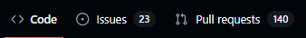

# Репозиторий для курса бекенда 2024-2025 (Go version)

## Как работать с репозиторием

Каждый урок с комментариями буквально построчно можно посмотреть в `Pull Request(#номер_урока)`

В каждом уроке (pull request-e) есть описание с основными темами урока, ссылками на ресурсы, командами командной строки (если были необходимы).

# Специальные папки

`.github` - там содержаться CI для проверки вашего кода и медиа для README'шек, менять не рекомендуется :3